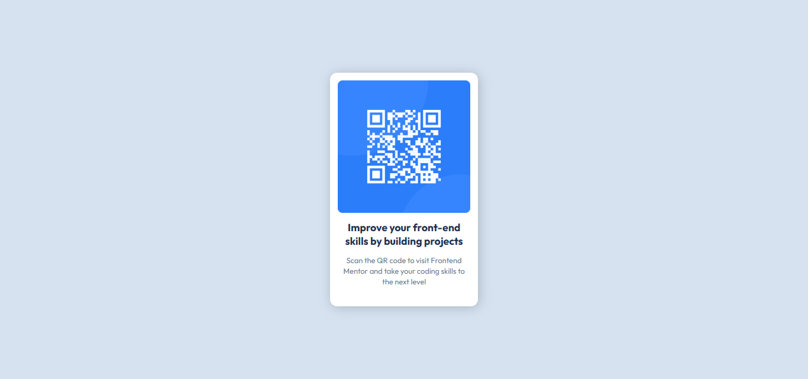

# ✈ QR Code Component
Frontend Mentor Challenge - A simple QR code component built using HTML & CSS.

## 📌 Live Demo
🔗 View Project on GitHub Pages: [QR Code Challenge](https://bhavikthakur.github.io/qr-code-challenge/)

## 🛠 Tech Stack
- HTML5
- CSS3 (Flexbox)
- Google Fonts (Outfit)

## 🎯 Overview
This project is a beginner-friendly challenge from Frontend Mentor. It involves creating a visually appealing QR code component that looks like a real-world card design. The main goal was to practice responsive layouts, typography, and box-shadow effects.

## ✨ Features
- ✔️ Fully responsive design
- ✔️ Clean & modern UI
- ✔️ Subtle hover effect on QR code
- ✔️ Centered layout with smooth spacing

## 📸 Screenshots




## 📂 Folder Structure
│── index.html <br>
│── style.css <br>
│── images/ <br>
│ ├── image-qr-code.png <br>
│ ├── favicon-32x32.png <br>


## 🧠 What I Learned
- How to use CSS Flexbox for centering content.
- Implementing a card layout with box-shadow and border-radius.
- Improving text readability using `text-wrap: balance;`.
- Using `max-width: 100%` for responsive images.

## 🚀 How to Use
1. Clone the repo:
   ```bash
   git clone https://github.com/bhavikthakur/qr-code-challenge.git


## 🤝 Connect With Me  
👨‍💻 GitHub: [bhavikthakur](https://github.com/bhavikthakur)  <br>
💼 LinkedIn: [Bhavik Thakur](https://www.linkedin.com/in/bhavik-thakur/)  <br>
🐦 Twitter: [Bhavik Thakur](https://x.com/BhavikkThakur)  <br>
